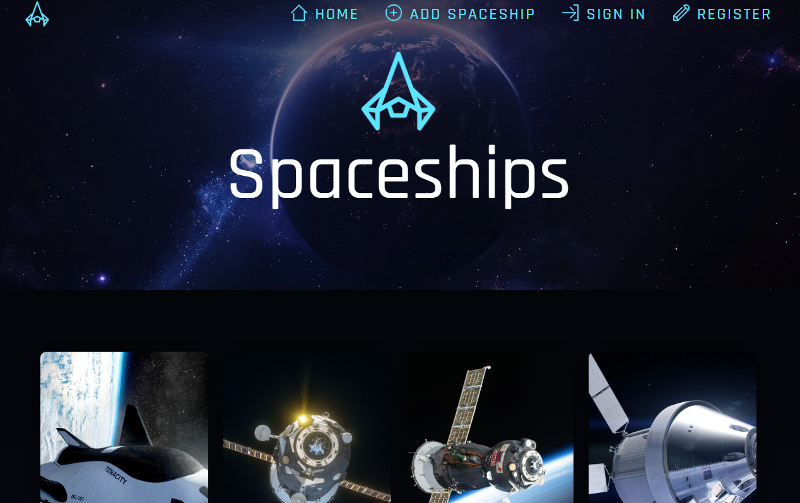

# ASP.NET Core MVC - Group Assignment

## 🔗Table of Contents
- [📌 Assignment Goals](#assignment-goals)
- [🏠 App Home Page](#app-home-page)
- [📐 Clean Architecture Overview](#clean-architecture-overview)
- [📋 Features](#features)
  - [📄 Entity List Page](#entity-list-page)
  - [📝 Create Form](#create-form)
  - [✅ Form Validation](#form-validation)
  - [🔐 Authentication and Authorization](#authentication-and-authorization)
  - [🖼️ Razor Views & MVC Features](#razor-views--mvc-features)
  - [💾 Data Access](#data-access)
  - [🧪 Unit Testing](#unit-testing)
  - [🖥️ Console Application](#console-application)
- [🛠️ Technologies Used](#technologies-used)
- [🚀 Getting Started](#getting-started)

---

## Assignment Goals
This is a collaborative project aimed at building a full-featured **ASP.NET Core MVC** web application using **Clean Architecture** principles. The goal is to demonstrate proficiency in modern ASP.NET Core development by applying:

- ✅ MVVMC design pattern
- ✅ Clean separation of concerns
- ✅ Authentication and role-based authorization
- ✅ ViewModels and Razor Views
- ✅ Structured data access with Entity Framework Core and SQL Server
- ✅ Unit testing using xUnit and Moq

---

# App Home Page

---

# Clean Architecture Overview

This application follows **Clean Architecture**, which promotes separation of concerns, testability, and maintainability. The project is structured into the following layers:

- 🧠 **Domain** — contains core entities and business rules
- ⚙️ **Application** — defines use cases and interfaces
- 🗄️ **Infrastructure** — implements data access using **Entity Framework Core** with **SQL Server**
- 🌐 **WebUI (MVVMC)** — user interface layer using ASP.NET Core MVC and Razor Views
- 🖥️ **ConsoleClient** — standalone CLI client that consumes the Application layer
- 🧪 **Tests** — includes unit tests for Application and WebUI layers

---

# Features:

### Entity List Page
- Displays all entities retrieved from the database.

### Create Form
- A form that allows users to create and add new entities.

### Form Validation
- **Client-side**: HTML and JavaScript validation
- **Server-side**: Data Annotations and `ModelState.IsValid`

### Authentication and Authorization
- User registration and login using **ASP.NET Core Identity**
- Protected members-only page: `/members`
- Admin-only page: `/admin` (requires "Administrators" role)

### Razor Views & MVC Features
- Shared layout using `_Layout.cshtml`
- `_ViewStart.cshtml` and `_ViewImports.cshtml` configured
- One unique **ViewModel per View**
- At least two **Controller** classes: one for entities, one for user accounts

### Data Access
- Uses **Entity Framework Core** for Object-Relational Mapping (ORM)
- SQL Server LocalDB is the database provider
- Database context (`DbContext`) and code-first **migrations** are configured in the **Infrastructure** layer
- Application layer communicates with data access through well-defined interfaces

### Unit Testing
- **Application services** tested in `Application.Tests`
- **Controllers** tested in `WebUI.Tests`

### Console Application
- `ConsoleClient` project reads and displays entities using the **Application** layer only

---

# Technologies Used  
- 🔷 **ASP.NET Core 9.0 MVC**
- 💬 **C#**
- 📄 **Razor Views**
- 💽 **Entity Framework Core with SQL Server LocalDB**
- 🔐 **ASP.NET Core Identity**
- 🧪 **xUnit** and **Moq**
- 🖥️ **Visual Studio 2022+**

---

# Getting Started
1. Clone the repository
2. Apply migrations and update the database
3. Run the WebUI project
4. Use the ConsoleClient to test core functionality

---
